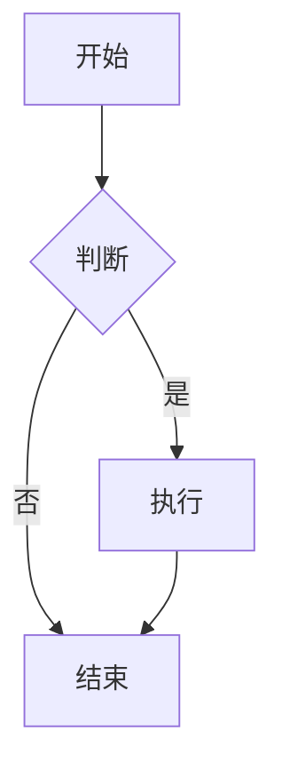

# Markdown Viewer

高性能的 Markdown 阅读器，让文档更专业、编辑更高效。

## ✨ 为什么选择它

### 🎯 核心亮点：自动转 PNG，完美分享

**解决的痛点**：Markdown 文档中的图表无法直接用于 Office 文档
- Mermaid 代码在 Word 中无法显示
- HTML 表格粘贴后排版错乱、字体混乱
- SVG 图像在不同软件中兼容性差
- 截图模糊，质量不专业

**我们的方案**：
- ✅ **智能转换**：Mermaid 图表、HTML 内容、SVG 图像自动转为高清 PNG
- ✅ **所见即所得**：完美还原样式，布局、字体、颜色完全一致
- ✅ **右键复制**：一键复制，直接粘贴到 Word、PPT、邮件、微信
- ✅ **高保真质量**：4倍超采样，放大也清晰

### ⚡ 极速体验：异步渲染 + 智能缓存

**打开文档立即可读**
- 文档内容瞬间显示，不等待图表加载
- 图表在后台异步渲染，完成后自动替换
- 大文件也能秒开，完全不阻塞阅读

**越用越快**
- 首次加载需要几秒（下载渲染库）
- 之后打开同一文档：瞬间完成（智能缓存）
- 缓存自动管理，无需手动清理

### 📊 强大的内容支持

**10+ 种 Mermaid 图表**
- 流程图、时序图、甘特图、类图、状态图
- 实体关系图、饼图、思维导图等

**HTML 自由布局**
- 支持嵌入完整的 HTML 代码
- 高度自由的布局能力，突破 Markdown 限制
- 复杂表格、多列布局、自定义样式
- 自动转为 PNG，样式完美保留

**学术级数学公式**
- 完整 LaTeX 语法支持（KaTeX）
- 行内公式和块级公式
- 论文写作专业级渲染

**代码高亮**
- 100+ 编程语言支持
- GitHub 风格代码块
- 专业的语法着色

### 📱 贴心的阅读体验

**智能导航**
- 自动生成侧边栏目录
- 长文档快速定位
- `Ctrl/Cmd + B` 快捷键切换

**记忆功能**
- 刷新页面自动恢复阅读位置
- 等待图片加载完成后精确定位

**响应式设计**
- 桌面端固定侧边栏
- 移动端滑出式目录
- 打印友好样式

## 🎯 适合谁用

### 👨‍💻 程序员
- 查看 GitHub/GitLab 的 README 和项目文档
- 预览本地 Markdown 笔记和技术文档
- 将架构图导出到设计文档中

### 📝 技术作者
- 编写包含流程图的产品文档
- 在技术文章中使用数学公式
- 轻松将图表导出到 Word/PPT

### 🎓 学生和研究者
- 用 Markdown 做课程笔记
- 在学术文章中使用 LaTeX 公式
- 将实验流程图导出到论文

### 💼 日常办公
- 快速浏览和编辑技术文档
- 制作包含图表的需求文档
- 团队知识库文档管理

## 📦 安装使用

### 快速安装
1. 访问 Chrome Web Store 搜索 "Markdown Viewer"
2. 点击"添加至 Chrome"
3. 确认安装权限

### 启用本地文件访问（重要）
如果需要打开电脑上的 `.md` 文件（本地文档、团队分享的文件等）：
1. 打开 `chrome://extensions/`
2. 找到 Markdown Viewer
3. 开启"允许访问文件网址"

**为什么需要这一步？**
- 查看本地保存的 Markdown 文档
- 打开同事分享的 `.md` 文件
- 预览编辑器中的文档效果
- 离线阅读下载的技术文档

### 开始使用
- **在线文档**：直接打开任何 `.md` 或 `.markdown` 链接
- **本地文件**：拖拽文件到浏览器，或通过文件管理器打开
- **GitHub 文档**：自动渲染 GitHub/GitLab 上的 Markdown 文件

## 🎨 功能展示

### 支持的图表类型

使用 Mermaid 语法可以绘制：
- 流程图 (Flowchart)
- 时序图 (Sequence Diagram)
- 甘特图 (Gantt Chart)
- 类图 (Class Diagram)
- 状态图 (State Diagram)
- 实体关系图 (ER Diagram)
- 饼图 (Pie Chart)
- 思维导图 (Mindmap)

**示例代码：**
````markdown

````

### 数学公式示例

**行内公式：** 质能方程 `$E = mc^2$`

**块级公式：**
```markdown
$$
\frac{-b \pm \sqrt{b^2-4ac}}{2a}
$$
```

### HTML 和 SVG 自动转换

不仅支持 Mermaid，文档中的 HTML 内容和 SVG 图像也会自动转为 PNG：

**HTML 内容转换**
- 嵌入的复杂 HTML 表格、图表自动渲染为图片
- 完美解决排版错乱、字体差异等兼容性问题
- 所见即所得，导出后样式完全一致

**SVG 图像转换**
- 本地 SVG 文件：``
- 远程 SVG 链接：自动下载并转换
- 4倍超采样确保清晰度

**为什么转 PNG？**
HTML 和 SVG 在不同环境下常见问题：
- ❌ 布局错乱：缺少 CSS 样式导致排版崩溃
- ❌ 字体差异：系统字体不一致导致显示效果不同
- ❌ 兼容性差：Word/PPT 对 HTML/SVG 支持有限

转为 PNG 后：
- ✅ 布局固定：排版完美保持，不会错乱
- ✅ 样式锁定：字体、颜色、间距完全一致
- ✅ 通用兼容：任何软件都能正确显示

转换后可以直接复制粘贴到任何文档，无需手动处理。

### 导出图表到 Office

1. 所有内容（Mermaid/HTML/SVG）自动渲染为高清 PNG 格式
2. 右键点击图表，选择"复制图片"
3. 在 Word/PowerPoint 中直接粘贴（`Ctrl/Cmd + V`）

**为什么选择 PNG 格式？**
- ✅ **所见即所得**：导出的图片完美还原浏览器中的显示效果
- ✅ **环境无关**：不依赖字体、样式表，在任何设备上显示一致
- ✅ **完美兼容**：Word、PPT、邮件、聊天工具通用支持
- ✅ **高保真质量**：4倍超采样，放大也清晰

不需要任何截图工具，一键搞定！

## ⚙️ 常用功能

### 缓存管理
点击浏览器工具栏的扩展图标，可以：
- 查看缓存使用情况
- 一键清理缓存
- 查看缓存的图表数量和大小

### 快捷键
- `Ctrl/Cmd + B`：显示/隐藏目录（B = Bookmark/目录）

### 打印文档
按 `Ctrl/Cmd + P` 打印时，会自动：
- 隐藏侧边栏目录
- 优化页面布局
- 确保图片和表格正确分页

## ❓ 常见问题

**Q: 为什么打开文档时图表还在加载？**  
A: 这是异步渲染设计：文档内容立即显示让你开始阅读，图表在后台处理完成后自动替换占位符，完全不阻塞浏览。

**Q: 第一次打开为什么较慢？**  
A: 首次需要加载渲染库（Mermaid、数学公式等），之后会被缓存，加载速度大幅提升。

**Q: 本地文件打不开？**  
A: 需要在扩展设置中开启"允许访问文件网址"权限。

**Q: 如何复制图表？**  
A: 所有图表都会自动转为 PNG 格式，右键点击即可复制，然后粘贴到任何地方。

**Q: 支持暗色主题吗？**  
A: 当前版本使用浅色主题，适合大多数阅读场景和打印需求。

**Q: 缓存占用太多空间？**  
A: 点击扩展图标，可以查看缓存大小并一键清理。缓存会自动管理，通常不需要手动清理。

**Q: 支持哪些浏览器？**  
A: 支持所有基于 Chromium 的浏览器（Chrome、Edge、Brave 等）。

## 📚 Markdown 语法支持

### 基础语法
- 标题（H1-H6）
- 粗体、斜体、删除线
- 有序列表、无序列表
- 链接、图片
- 引用块
- 代码块

### GitHub 风格扩展 (GFM)
- 表格
- 任务列表
- 删除线
- 自动链接

### 高级功能
- 数学公式（KaTeX）
- 图表（Mermaid）
- 代码语法高亮
- 自动生成目录

## 🔗 相关链接

- **GitHub 仓库**: https://github.com/xicilion/markdown-viewer-extension
- **问题反馈**: https://github.com/xicilion/markdown-viewer-extension/issues
- **作者**: [xicilion](https://github.com/xicilion)

## 📄 许可证

[ISC License](LICENSE)

---

**让 Markdown 阅读更专业，让文档分享更高效！**
