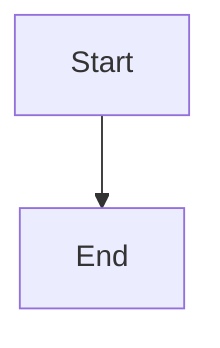

# VS Code Extension

Markdown Viewer is available as a VS Code extension, allowing you to preview and export Markdown documents directly within your editor.

## Overview

| Feature | Status |
|---------|--------|
| Markdown preview | ✅ |
| Word export | ✅ |
| All diagram types | ✅ |
| LaTeX formulas | ✅ |
| 29 themes | ✅ |
| Live preview | ✅ |

---

## Installation

### From VS Code Marketplace

1. Visit [VS Code Marketplace - Markdown Viewer Extension](https://marketplace.visualstudio.com/items?itemName=xicilion.markdown-viewer-extension)
2. Click **Install**
3. Or open VS Code, go to Extensions (`Ctrl+Shift+X` / `Cmd+Shift+X`)
4. Search for **"Markdown Viewer Extension"**
5. Click **Install**

### From Open VSX

For VSCodium or offline installations:

1. Visit [Open VSX - Markdown Viewer Extension](https://open-vsx.org/extension/xicilion/markdown-viewer-extension)
2. Click **Install**

### From Command Line

```bash
code --install-extension xicilion.markdown-viewer-extension
```

---

## Features

### Live Preview

As you edit your Markdown file, the preview updates in real-time.

**Open Preview:**
- Command Palette: `Markdown Viewer: Open Preview`
- Keyboard: `Ctrl+Shift+V` / `Cmd+Shift+V`
- Right-click file → "Open Preview"

### Side-by-Side Editing

Edit and preview simultaneously:
- `Ctrl+K V` / `Cmd+K V` — Open preview to the side

### Export to Word

Export the current document to Word:
- Command Palette: `Markdown Viewer: Export to Word`
- Right-click in editor → "Export to Word"

---

## Usage

### Opening Preview

1. Open a `.md` file in VS Code
2. Click the preview icon in the top-right corner
   - Or use keyboard shortcut `Ctrl+Shift+V`
3. Preview opens in a new tab

### Exporting

1. Open the Markdown file
2. Open Command Palette (`Ctrl+Shift+P` / `Cmd+Shift+P`)
3. Type "Markdown Viewer: Export to Word"
4. Choose save location
5. Word document is created

---

## Settings

Access settings: `File → Preferences → Settings → Markdown Viewer`

| Setting | Default | Description |
|---------|---------|-------------|
| `markdownViewer.theme` | `default` | Document theme |
| `markdownViewer.fontSize` | `14` | Preview font size |
| `markdownViewer.lineHeight` | `1.5` | Line height |

### settings.json Example

```json
{
  "markdownViewer.theme": "business",
  "markdownViewer.fontSize": 16,
  "markdownViewer.lineHeight": 1.6
}
```

---

## Diagrams in VS Code

All diagram types work in VS Code:

### Mermaid

````markdown

````

### Graphviz

````markdown

````

### Vega-Lite

````markdown
```vega-lite
{
  "data": {"values": [{"x": 1, "y": 2}]},
  "mark": "point",
  "encoding": {
    "x": {"field": "x"},
    "y": {"field": "y"}
  }
}
```
````

---

## Keyboard Shortcuts

| Action | Windows/Linux | macOS |
|--------|---------------|-------|
| Open Preview | `Ctrl + Shift + V` | `Cmd + Shift + V` |
| Preview to Side | `Ctrl + K V` | `Cmd + K V` |
| Export to Word | Via Command Palette | Via Command Palette |

---

## Integration with VS Code

### Works With

- ✅ VS Code built-in Markdown features
- ✅ Git diff view
- ✅ Remote workspaces
- ✅ WSL
- ✅ GitHub Codespaces

### File Types

| Extension | Language ID | Supported |
|-----------|-------------|-----------|
| `.md` | `markdown` | ✅ |
| `.markdown` | `markdown` | ✅ |
| `.mermaid` | `mermaid` | ✅ |
| `.vega`, `.vl` | `vega` | ✅ |
| `.gv`, `.dot` | `graphviz` | ✅ |
| `.infographic` | `infographic` | ✅ |

---

## Advantages Over Browser Extension

| Aspect | VS Code | Browser |
|--------|---------|---------|
| **Editing** | Native code editing | View only |
| **Live Preview** | Real-time as you type | Manual refresh |
| **File Management** | Full VS Code features | Browser-based |
| **Git Integration** | Built-in | None |
| **Workspace** | Multi-file projects | Single file |

**Use VS Code** when you're actively writing and editing.
**Use Browser** when you're reading or sharing documents.

---

## Troubleshooting

### Preview Not Showing?

1. Verify the extension is installed and enabled
2. Check file type is `.md` or `.markdown`
3. Try reloading VS Code window (`Ctrl+Shift+P` → "Reload Window")

### Diagrams Not Rendering?

1. Check diagram syntax
2. Wait for initial render (may take a moment)
3. Check VS Code Developer Tools for errors

### Export Fails?

1. Ensure you have write permissions
2. Check available disk space
3. Try a different save location

---

## Development

### Building from Source

```bash
cd vscode
npm install
npm run build
```

### Testing

```bash
npm run test
```

### Debugging

1. Open project in VS Code
2. Press `F5` to launch Extension Development Host
3. Test in the new VS Code window

---

## Source Code

GitHub: [xicilion/markdown-viewer-extension](https://github.com/xicilion/markdown-viewer-extension)

VS Code-specific code is in the `vscode/` directory.
